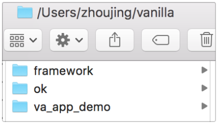
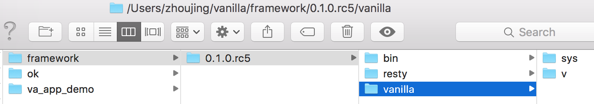

##目录结构


###Vanilla-0.1.0.rc5推荐的目录结构

*vanilla-0.1.0.rc5是对vanilla-0.1.0.rc4工程化的改进版，主要有以下2点推荐：*

#### Vanilla_Root（框架和App都放到这个路径下）
Vanilla相关的框架和App放到统一的一个目录（Vanilla_Root）下，比如我的是`/Users/zhoujing/vanilla`（方便管理，另外也告诉你Vanilla就是一个框架，放在哪儿都可以使用）



#### 框架与App
将Vanilla安装到`{Vanilla_Root}/framework`下，并使用全路径新建App：`vanilla new {Vanilla_Root}/va_app_demo`

框架的目录结构如下



Vanilla App的目录结构如下


###0.1.0.rc4之前版本的目录说明
之前的vanilla默认安装在`/usr/local/vanilla`给大家传递了一个不好的信号，好像vanilla是一个服务，其实vanilla仅仅是一个MVC框架

#### *vanilla新建的App代码目录结构及说明*
```
 /Users/zj-git/app_name/ tree ./
./
├── application（应用代码主体目录）
│   ├── bootstrap.lua（应用初始化 / 可选<以下未标可选为必选>）
│   ├── controllers(应用业务代码主体目录)
│   │   ├── error.lua（应用业务错误处理，处理本路径下相应业务报错）
│   │   └── index.lua（hello world示例）
│   ├── library（应用本地类包）
│   ├── models（应用数据处理类）
│   │   ├── dao（数据层业务处理）
│   │   │   └── table.lua
│   │   └── service（服务化业务处理，对DAO的再次封装）
│   │       └── user.lua
│   ├── nginx（*Openresty所封装Nginx请求处理各Phase）
│   │   └── init.lua（*init_by_lua示例）
│   ├── plugins（插件目录）
│   └── views（视图层，与controllers一一对应）
│       ├── error（错误模板）
│       │   └── error.html
│       └── index（index controller模板）
│           └── index.html
├── config（应用配置目录）
│   ├── application.lua（应用基础配置 / 路由器、初始化等设置）
│   ├── errors.lua（应用错误信息配置）
│   ├── nginx.conf（nginx配置文件模板）
│   ├── nginx.lua（服务各种运行环境配置 / 是否开启lua_code_cache等）
│   ├── waf-regs（应用防火墙规则配置目录）
│   │   ├── args
│   │   ├── cookie
│   │   ├── post
│   │   ├── url
│   │   ├── user-agent
│   │   └── whiteurl
│   └── waf.lua（服务防火墙配置）
├── logs（日志目录）
│   └── hack（攻击日志目录 / 保持可写权限）
├── pub（应用Nginx配置根路径）
    └── index.lua（应用请求入口）
```

### 社区组织
#### *QQ群&&微信公众号*
- *Openresty/Vanilla 开发 1 群：205773855（已满）*
- *Openresty/Vanilla 开发 2 群：419191655*
- *Openresty 技术交流 1 群：34782325（已满）*
- *Openresty 技术交流 2 群：481213820（已满）*
- *Openresty 技术交流 3 群：124613000*
- *Vanilla开发微信公众号:Vanilla-OpenResty(Vanilla相关资讯、文档推送)*


[](http://shang.qq.com/wpa/qunwpa?idkey=673157ee0f0207ce2fb305d15999225c5aa967e88913dfd651a8cf59e18fd459)