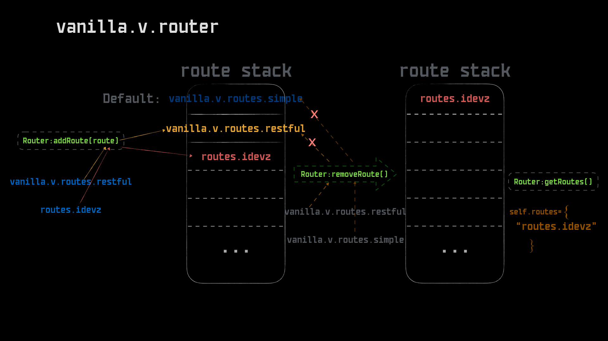

## 路由
*路由是香草/Vanilla的请求分发的关键，这个过程由路由器```vanilla.v.router```和一序列路由协议协同完成（从```vanilla-0.1.0.rc4```开始，vanilla支持两种比较实用的路由协议```vanilla.v.routes.restful```和```vanilla.v.routes.simple```）*


- *简单路由协议```vanilla.v.routes.simple```用法*
- *Restful路由协议```vanilla.v.routes.restful```用法*
- *路由实现*

### *简单路由协议```vanilla.v.routes.simple```用法*

简单路由协议```vanilla.v.routes.simple``` 是Vanilla协议栈中默认使用的协议，不需要特殊配置，直接可用

##### *使用Tips：*

- *URI为根'/'时，```controller```和```action```都默认为```index```*
- *按照URI的路径进行分割，最后的一段为```action```，前面则为```controller```（例如URI为'/a/b/c'，则路由结果```controller```为```a.b```，```action```为```c```）*

### *Restful路由协议```vanilla.v.routes.restful```用法*

Restful路由协议```vanilla.v.routes.restful```以一种```map```的形式来配置Vanilla路由规则，提供了更灵活的URL控制，如果需要启用此路由，需要以下几步：

- *Bootstrap中初始化router*
- *在项目config/路径下放置```restful.lua```文件，并在```restful.lua```中配置相关路由规则*

##### *Bootstrap中初始化initRoute，并打开boot_list中的```Bootstrap.initRoute```*

```lua
function Bootstrap:initRoute()
    local router = self.dispatcher:getRouter()
    local restful_route = require('vanilla.v.routes.restful'):new(self.dispatcher:getRequest())
    router:addRoute(restful_route)		--此时协议栈中加上默认的vanilla.v.routes.simple，一共两个路由协议，如果只想使用一个路由协议，可以给addRoute传入第二个参数true	
end

function Bootstrap:boot_list()
    return {
        -- Bootstrap.initWaf,
        -- Bootstrap.initErrorHandle,
        Bootstrap.initRoute,
        -- Bootstrap.initView,
        -- Bootstrap.initPlugin,
    }
end
```

##### *项目config/restful.lua配置*
```
local restful = {
    v1={},				--接口版本定义
    v={}				--web版本定义
}

restful.v.GET = {
    {pattern = '/user/:user_id', controller = 'test.index', action = 'web_rule'},
    {pattern = '/', controller = 'test.index', action = 'web_root'},
}
restful.v1.GET = {
    {pattern = '/user/:user_id', controller = 'test.index', action = 'api_v1_rule'},
    {pattern = '/', controller = 'test.index', action = 'api_root'},
    {pattern = '/test/index/index', controller = 'test.index', action = 'index'},
}

return restful
```

请求实例（app_name：idevz.org）：```curl -X GET -H 'accept: application/vnd.idevz.org.v1.2.3.json' http://localhost:9210/test/index/INDEX```

##### *restful.lua配置Tips:*

1. 定义各种版本的空表，如上例子中```v1```和```v```两个版本，```v```后面不跟数字，则表示web服务的版本。
2. 接口版本的访问需要在请求头（accept）中提供相应的版本信息如：```-H 'accept: application/vnd.idevz.org.v1.2.3.json'```
3. 目前支持的方法```GET,POST,HEAD,OPTIONS,PUT,PATCH,DELETE,TRACE,CONNECT```

### 路由实现

*Vanilla通过路由器管理着一个路由协议栈，并通过遍历协议栈上每一个路由协议的```match```方法来获取当前请求的```controller```和```action```*

下面是```vanilla.v.router```目前所提供的函数列表：

```
function Router:new(request) --传入request实例初始化路由器，默认已经启用：vanilla.v.routes.simple
function Router:addRoute(route, only_one) --添加路由协议
function Router:removeRoute(route_name) --传入路由协议名称删除路由协议
function Router:getRoutes() --获取当前的路由协议栈
function Router:getCurrentRoute() --获取当前请求所使用的路由协议实例
function Router:getCurrentRouteName() --获取当前请求所使用的路由协议名称
function Router:route() --路由当前请求
```

##### *路由协议栈*
```lua
function Router:new(request)
    local instance = {
        routes = {require('vanilla.v.routes.simple'):new(request)},
    	request = request
    }

    setmetatable(instance, {__index = self})
    return instance
end
```
Router.routes就是Router管理的路由协议栈，默认已经添加```vanilla.v.routes.simple```实例，路由器由一个```request```实例和一个协议栈构成。
而每个路由协议的关键在于```match```方法，这是返回当前请求走向哪个```controller```和哪个```action```的关键。
```
local function route_match(route)
    return route:match()
end

function Router:route()
    if #self.routes >= 1 then
        local alive_route_num = 0
        local route_err = {}
        for k,route in ipairs(self.routes) do
            if route then
                alive_route_num = alive_route_num + 1
                local ok, controller_name_or_error, action = pcall(route_match, route)
                if ok and controller_name_or_error then
                    self.current_route = route
                    return controller_name_or_error, action
                else
                    route_err[k] = controller_name_or_error
                end
            end
        end
        error({ code = 201, msg = {
            Routes_No_Match = alive_route_num .. "Routes All Didn't Match. Errs Like: " .. tconcat( route_err, ", ")}})
    end
    error({ code = 201, msg = {Empty_Routes = 'Null routes added.'}})
end
```

##### *路由协议的加载与管理*

一张图展示路由器对路由协议栈的管理：
